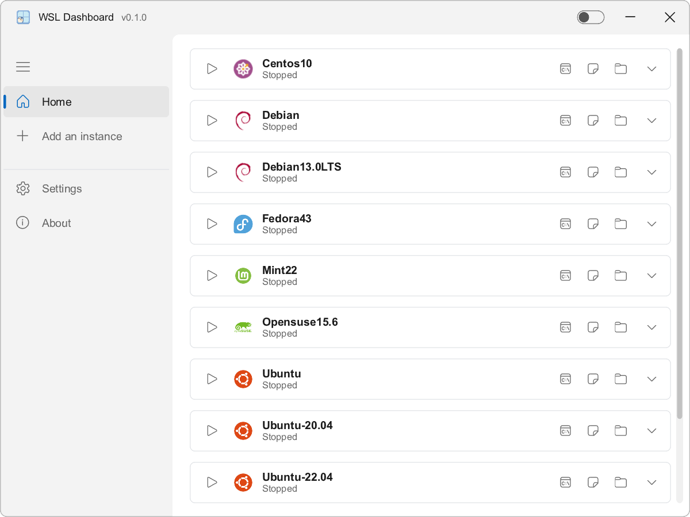
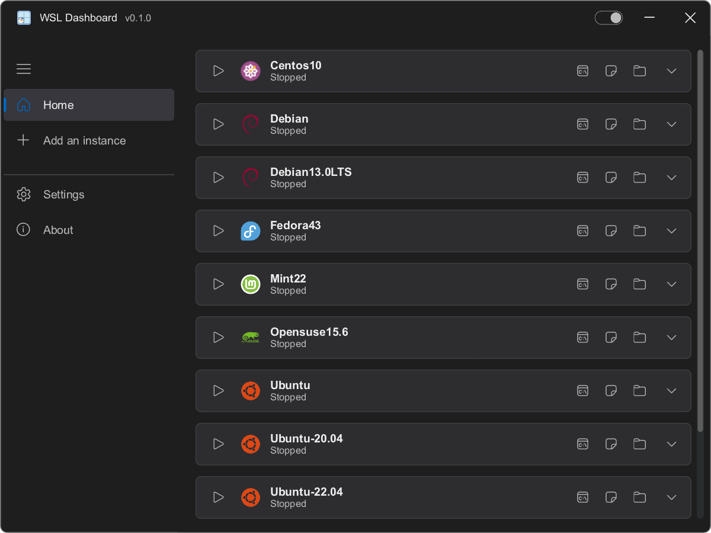
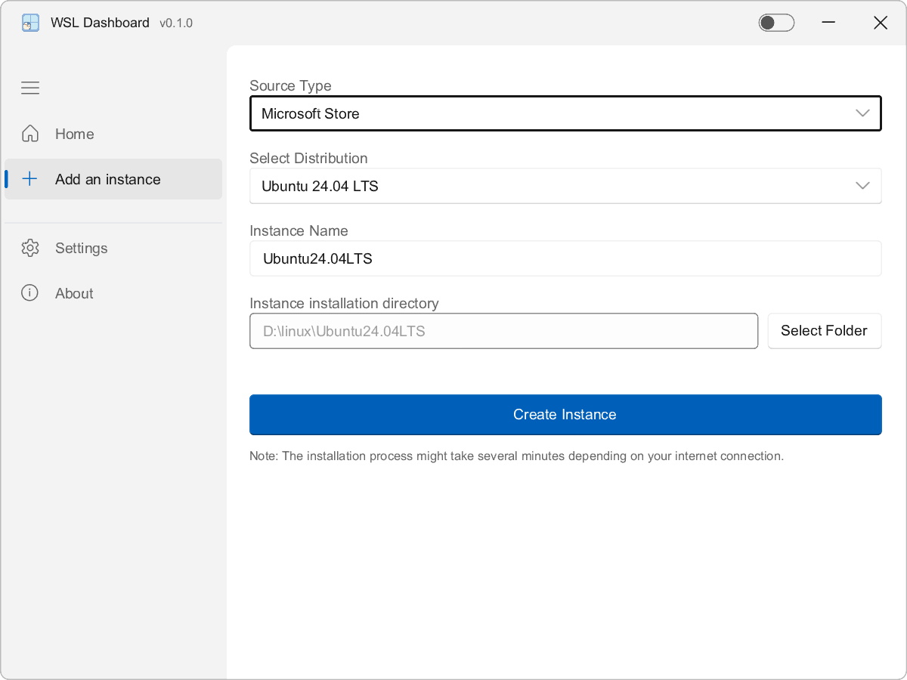
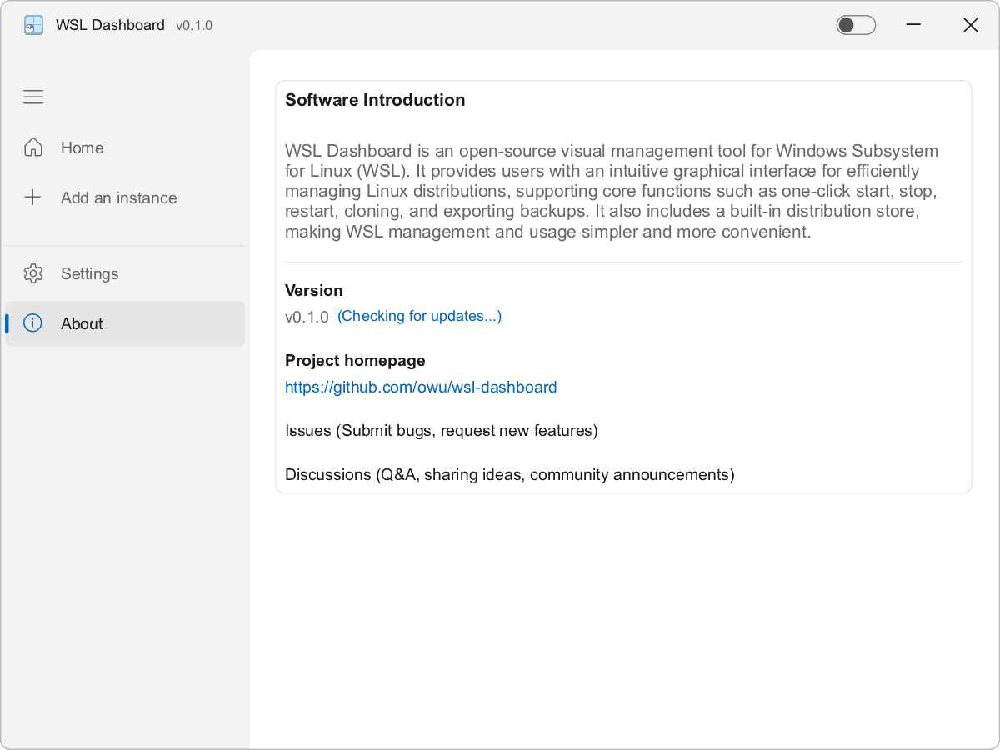
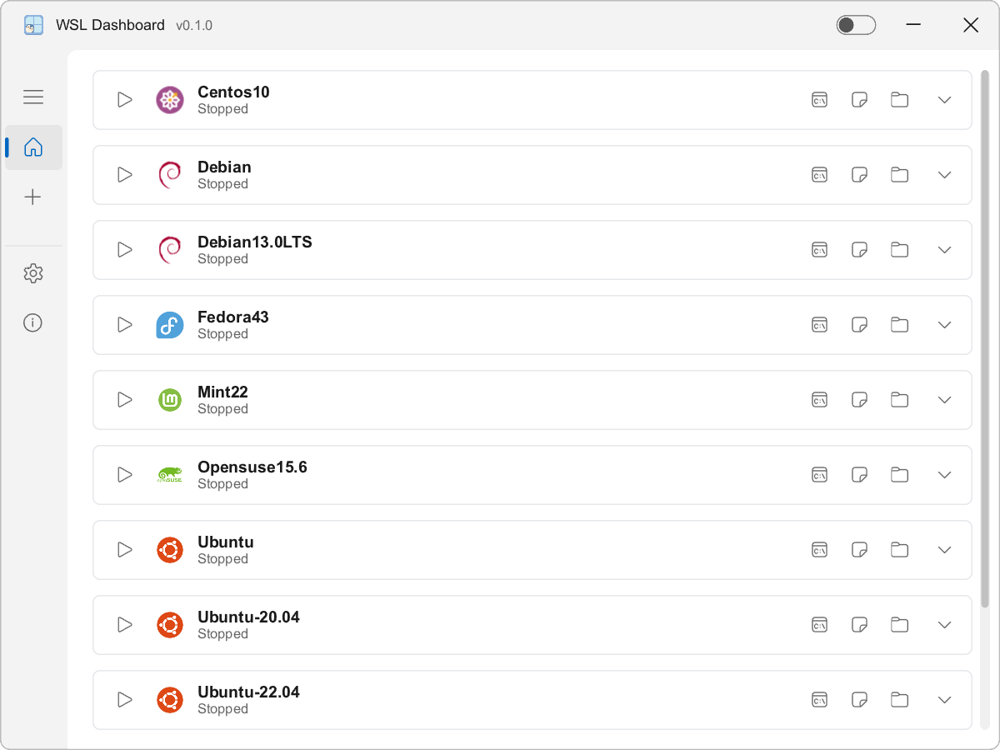

# WSL Dashboard

<p align="center">
  
</p>

WSL (Windows Subsystem for Linux) ইনস্ট্যান্স পরিচালনা করার জন্য একটি আধুনিক, উচ্চ-ক্ষমতাসম্পন্ন এবং হালকা ড্যাশবোর্ড। প্রিমিয়াম নেটিভ অভিজ্ঞতার জন্য Rust এবং Slint দিয়ে তৈরি।

---

[](https://www.rust-lang.org)
[](https://slint.dev)
[](LICENSE)

I18N: [简体中文](./README_zh_CN.md) | [繁體中文](./README_zh_TW.md) | [English](../README.md) | [日本語](./README_ja.md) | [Français](./README_fr.md) | [Español](./README_es.md) | [Русский](./README_ru.md) | [Português](./README_pt.md) | [Deutsch](./README_de.md) | [Italiano](./README_it.md) | [Türkçe](./README_tr.md) | [Bahasa Indonesia](./README_id.md) | [हिन्दी](./README_hi.md) | বাংলা

---

## 🖼️ স্ক্রিনশট

### হোম (লাইট এবং ডার্ক মোড)
<p align="center">
  
  
</p>

### ইনস্ট্যান্স যোগ করুন এবং সেটিংস
<p align="center">
  
  
</p>

### পরিচিতি এবং মেনু কলাপস
<p align="center">
  
  
</p>

## 🎬 অপারেশন ডেমো

নিচে WSL Dashboard-এর কাজ করার একটি ডেমো দেওয়া হলো:


## 🚀 মূল বৈশিষ্ট্যসমূহ

- ডার্ক মোড সাপোর্ট এবং মসৃণ অ্যানিমেশনসহ স্বজ্ঞাত GUI।
- আপনার সমস্ত WSL ডিস্ট্রিবিউশনের জন্য ওয়ান-ক্লিক ম্যানেজমেন্ট (শুরু, বন্ধ, সমাপ্ত, আনরেজিস্টার)।
- ডিস্ট্রিবিউশন টার্মিনাল, VS Code এবং ফাইল এক্সপ্লোরারে দ্রুত অ্যাক্সেস।
- বিস্তৃত ডিস্ট্রিবিউশন সেটিংস: ডিফল্ট হিসাবে সেট করুন, বুট করার সময় স্বয়ংক্রিয় স্টার্টআপ এবং কাস্টম ডিরেক্টরি পাথ।
- রিয়েল-टाइम WSL ইনস্ট্যান্সের অবস্থা পর্যবেক্ষণ এবং প্রদর্শন।
- এক্সপোর্ট এবং ব্যাকআপ `.tar` বা সংকুচিত `.tar.gz` আর্কাইভে।
- ব্যাকআপ বা বিদ্যমান ডিস্ট্রিবিউশন থেকে ইনস্ট্যান্স ইম্পোর্ট এবং ক্লোন করুন।
- C: ড্রাইভের জায়গা বাঁচাতে ডিস্ট্রিবিউশনটি নির্দিষ্ট ডিরেক্টরিতে (VHDX মাইগ্রেশন) সরান।
- Microsoft Store বা GitHub থেকে স্মার্ট ডিস্ট্রিবিউশন ইনস্টলেশন।
- ম্যানুয়াল ইনস্টলেশনের জন্য অন্তর্নির্মিত RootFS ডাউনলোড সহকারী।
- VHDX ফাইলের অবস্থান, ভার্চুয়াল ডিস্ক সাইজ এবং আসল ডিস্ক ব্যবহারের বিস্তারিত তথ্য।

## সিস্টেমের প্রয়োজনীয়তা

- WSL এনাবলসহ Windows 10 বা Windows 11 (WSL 2 সুপারিশকৃত)।
- অন্তত একটি WSL ডিস্ট্রিবিউশন ইনস্টল করা থাকতে হবে, অথবা নতুন ইনস্টল করার অনুমতি থাকতে হবে।
- ৬৪-বিট CPU; একাধিক ডিস্ট্রিবিউশন মসৃণভাবে ব্যবহারের জন্য ৪ জিবি র‌্যাম বা তার বেশি সুপারিশকৃত।

## 📦 ইনস্টলেশন

### অপশন ১: প্রি-বিল্ট বাইনারি ডাউনলোড করুন

শুরু করার সবচেয়ে সহজ উপায় হলো আগে থেকে কম্পাইল করা রিলিজ ব্যবহার করা:

1. [GitHub Releases](https://github.com/owu/wsl-dashboard/releases) পেজে যান।
2. Windows-এর জন্য সর্বশেষ `wsldashboard` এক্সিকিউটেবল ফাইলটি ডাউনলোড করুন।
3. এক্সট্রাক্ট করুন (যদি সংকুচিত থাকে) এবং `wsldashboard.exe` চালান।

কোনো ইনস্টলারের প্রয়োজন নেই; অ্যাপটি একটি একক পোর্টেবল বাইনারি।

### অপশন ২: সোর্স থেকে বিল্ড করুন

আপনার কাছে Rust টুলচেইন (Rust 1.92+ বা তার নতুন) ইনস্টল করা আছে তা নিশ্চিত করুন।

1. রিপোজিটরি ক্লোন করুন:

   ```powershell
   git clone https://github.com/owu/wsl-dashboard.git
   cd wsl-dashboard
   ```

2. বিল্ড এবং রান করুন:

   - ডেভেলপমেন্টের জন্য:

     ```powershell
     cargo run
     ```

   - অপ্টিমাইজড রিলিজ বিল্ড:

     ```powershell
     cargo run --release
     ```

   - বিল্ড স্ক্রিপ্ট ব্যবহার করা (রিলিজ বাইনারি তৈরির জন্য সুপারিশকৃত):

     > বিল্ড স্ক্রিপ্টের জন্য `x86_64-pc-windows-gnu` টুলচেইন প্রয়োজন।

     ```powershell
     .\build\scripts\build.ps1
     ```

## 🧭 ব্যবহারের সংক্ষিপ্ত বিবরণ

- **বিদ্যমান ডিস্ট্রিবিউশন পরিচালনা**: মূল ভিউ থেকে যেকোনো WSL ডিস্ট্রিবিউশন শুরু, বন্ধ, সমাপ্ত, আনরেজিস্টার বা ডিফল্ট হিসাবে সেট করুন।
- **ডিস্ট্রিবিউশন কনফিগার করুন**: অটো-স্টার্টআপ আচরণ সেট করুন এবং টার্মিনাল/VS Code লঞ্চ ডিরেক্টরি কাস্টমাইজ করুন।
- **দ্রুত টুল ওপেন করুন**: আপনার টার্মিনাল, VS Code বা ফাইল এক্সপ্লোরায় একটি ক্লিকেই ডিস্ট্রিবিউশন লঞ্চ করুন।
- **নতুন ইনস্ট্যান্স তৈরি করুন**: Microsoft Store থেকে ইনস্টল করতে, RootFS ইমেজ ডাউনলোড করতে বা বিদ্যমান ডিস্ট্রিবিউশন ক্লোন করতে 'Add Instance' ভিউ ব্যবহার করুন।
- **ব্যাকআপ এবং রিকোভারি**: ডিস্ট্রিবিউশনগুলোকে `.tar` / `.tar.gz` আর্কাইভে এক্সপোর্ট করুন এবং পরে বা অন্য মেশিনে ইম্পোর্ট করুন।
- **ডিস্ট্রিবিউশন সরান**: আরও ভাল স্টোরেজ ব্যবস্থাপনার জন্য ডিস্ট্রিবিউশনটি নির্দিষ্ট ডিরেক্টরিতে সরান।
- **অবস্থা পর্যবেক্ষণ**: WSL Dashboard চলাকালীন রিয়েল-টাইম ডিস্ট্রিবিউশন অবস্থা এবং স্টোরেজ ব্যবহারের ওপর নজর রাখুন।

## ⚙️ কনফিগারেশন এবং লগ

সেটিংস ভিউয়ের মাধ্যমে সমস্ত কনফিগারেশন পরিচালনা করা হয়:

- নতুন WSL ইনস্ট্যান্সের জন্য ডিফল্ট ইনস্টলেশন ডিরেক্টরি বেছে নিন।
- লগ ডিরেক্টরি এবং লগ লেভেল (Error / Warn / Info / Debug / Trace) কনফিগার করুন।
- UI ভাষা বেছে নিন অথবা এটিকে সিস্টেম ল্যাঙ্গুয়েজ অনুসরণ করতে দিন।
- ডার্ক মোড টগল করুন এবং অ্যাপ ব্যবহারের পর WSL অটো-শাটডাউন করতে পারবে কি না তা নির্ধারণ করুন।
- অ্যাপটি কতবার আপডেটের জন্য চেক করবে তা কনফিগার করুন (প্রতিদিন, প্রতি সপ্তাহে, প্রতি দুই সপ্তাহে, প্রতি মাসে)।

কনফিগার করা লগ ডিরেক্টরিতে লগ ফাইলগুলো লেখা হয় এবং সমস্যার রিপোর্ট করার সময় এগুলো যুক্ত করা যেতে পারে।

## 🛠️ টেক স্ট্যাক এবং পারফরম্যান্স

- **কোর**: মেমরি সুরক্ষা এবং জিরো-কস্ট অ্যাবস্ট্রাকশনের জন্য Rust-এ বাস্তবায়ন করা হয়েছে।
- **UI ফ্রেমওয়ার্ক**: Slint, একটি আধুনিক GPU-অ্যাক্সিলারেটেড UI টুলকিট (ব্যাকএন্ড: `winit`) ।
- **অ্যাসিঙ্ক রানটাইম**: উচ্চ কনকারেন্সি এবং নন-ব্লকিং সিস্টেম কমান্ড ও I/O-এর জন্য Tokio।
- **পারফরম্যান্স**:
  - **মেমরি ব্যবহার**: সাধারণত ৬০–৮০ এমবি র‌্যামের মতো।
  - **রেসপন্সিভনেস**: প্রায় তাৎক্ষণিক স্টার্টআপ এবং স্ট্রিমিং প্রযুক্তি ব্যবহার করে রিয়েল-টাইম WSL স্ট্যাটাস আপডেট।
  - **বাইনারি সাইজ**: অপ্টিমাইজড রিলিজ বিল্ড একটি একক কমপ্যাক্ট এক্সিকিউটেবল তৈরি করে।

## 🌍 ভাষা সমর্থন

নিচের ভাষাগুলোর জন্য পূর্ণ আন্তর্জাতিকীকরণ সমর্থন প্রদান করা হয়েছে:

| ভাষা | কোড | ইমোজি |
| :--- | :---: | :---: |
| সরলীকৃত চীনা | `zh-CN` | 🇨🇳 |
| ঐতিহ্যগত চীনা | `zh-TW` | 🇭🇰 / 🇹🇼 |
| ইংরেজি | `en` | 🇺🇸 |
| জাপানি | `ja` | 🇯🇵 |
| ফরাসি | `fr` | 🇫🇷 |
| স্প্যানিশ | `es` | 🇪🇸 |
| রুশ | `ru` | 🇷🇺 |
| পর্তুগিজ | `pt` | 🇵🇹 |
| জার্মান | `de` | 🇩🇪 |
| ইতালীয় | `it` | 🇮🇹 |
| তুর্কি | `tr` | 🇹🇷 |
| ইন্দোনেশীয় | `id` | 🇮🇩 |
| হিন্দি | `hi` | 🇮🇳 |
| বাংলা | `bn` | 🇧🇩 |

## 📄 লাইসেন্স

এই প্রজেক্টটি GPL-3.0-এর অধীনে লাইসেন্সপ্রাপ্ত - বিস্তারিত জানার জন্য [LICENSE](LICENSE) ফাইলটি দেখুন।

---

Built with ❤️ for the WSL Community.
